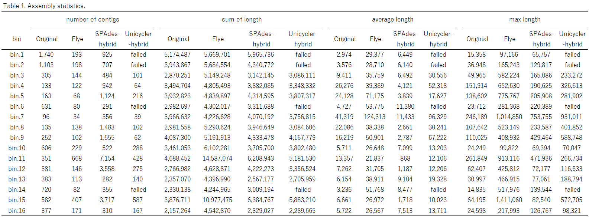
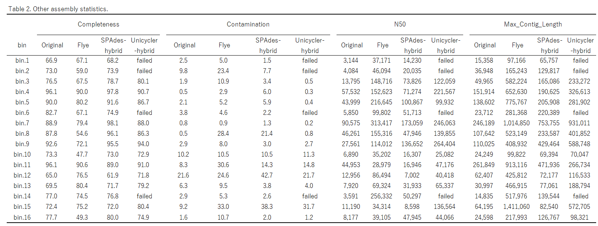

# MAG_refinement
  
Binned fasta sequences derived from the binning of raw metagenomic assembly consist of fragmented contigs that are broken at hundreds of positions within the genome. Gene prediction is significantly impacted by such fragmented draft genome sequences. This script aims to improve the contiguity of each bin (MAG) sequnece by reassembling bin using an isolated genome assembler with a combination of properly mapped HiFi long reads and short reads aligned to each bin sequence. The reassembly is orignally reported by doi: 10.1038/nbt.2579 or metaWRAP team. MetaWRAP team used SPAdes assembler with isolated genome mode to reassemble each bin's reads and to improve the assembly statistics.  
This script is compatible with dataset that have already undergone hybrid assembly using tools like metaSPAdes or OPERA-MS or short read assembly (not sure for long read only assembly.).


##  Workflow
Short and long reads related to each bin are extracted from whole metagenome shotgun sequencing reads.  
1. For short reads, Bowtie2 is used with the "--al-conc option and a normal insert size" to collect properly aligned short reads against bin sequnece.
2. For HiFi long reads, Minimap2 is used with the "-x map-hifi" option. High-quality mapping (MAPQ > 20) and small clipped alignment reads (less than 100-bp) are retained.
3. Each bin is reassembled using three different isolated genome assemblers to improve contiguity.  

- Unicycler (hybrid assembly)
- SPAdes (hybrid assembly)
- Flye (HiFi long reads assembly)
<br><br>
## Dependency  
- SAMTools
- Bowtie2 
- samclip
- minimap2
- Flye v2.9
- SPAdes v3.15
- Unicycler v5  

## Requirements (file)
- bin.fa files
- HiFi sequenicng reads (the one used for original assembly)
- Paired-end short sequenicng reads (the one used for original assembly)
  

## Installation  

```
git clone https://github.com/kazumaxneo/MAG_refinement.git
mamba env create --file MAG_refinement/env.yaml
conda activate binrefinemnet
chmod +x MAG_refinement/Bin_refinement.py
export PATH=$PATH:$PWD/MAG_refinement/
Bin_refinement.py -h
```


## Usage  
This script should be run in the directory containing users bin FASTA files.
It detects files matching the pattern bin*.fa (or the extension specified by --ext).
Required inputs

Paired-end short reads (--read1 / --read2)

PacBio HiFi long reads (--pacbio)

Output directories (will be created if not present)

--sr_dir : Directory to store properly mapped short reads

--hifi_mapped_dir : Directory to store properly mapped HiFi long reads

--refined_bin_dir : Directory to store refined bin assemblies
```
python Bin_refinement.py --read1 short_R1.fastq.gz --read2 short_R2.fastq.gz --pacbio HiF_reads.fq.gz --hifi_mapped_dir HIFI_saved_dir --sr_dir short_reads_saved_dir --refined_bin_dir refined_bin_dir
```

## parallel version
Difference  
Multiple assembler are runned in parallel (default 3 jobs).

Individual assembler working directories are deleted after copying the final assembly to --refined_bin_dir.

Flye is iteratively runned in CLR mode when run in HiFi mode are failed.

Statistics files are saved after all assemblers have finished.

Mapping logs are not displayed.
```
python Bin_refinement_parallel.py --read1 short_R1.fq.gz --read2 short_R2.fq.gz --pacbio HiF_reads.fq.gz --jobs 3 --max_total_threads 24 --ext fa
```
## Options

-h, --help
Show this help message and exit.

--read1 READ1
Path to the first paired-end short-read file (R1).

--read2 READ2
Path to the second paired-end short-read file (R2).

--pacbio PACBIO
Path to the PacBio HiFi (or CLR) long-read file.

--hifi_mapped_dir HIFI_MAPPED_DIR
Output directory for mapped HiFi reads (created when not existed in current path).

--sr_dir SR_DIR
Output directory for mapped short reads (created when not existed in current path).

--refined_bin_dir REFINED_BIN_DIR
Output directory for refined bin assemblies (created when not existed in current path).

--mapq MAPQ
Minimum mapping quality (MAPQ) threshold for read filtering (default 20).

--hifi_preset HIFI_PRESET
Preset option for minimap2 when mapping HiFi reads (e.g., hifi, map-pb).

--ext EXT
Extension of bin FASTA files to process (default .fa).

--jobs JOBS
Number of assembler to process in parallel (default 3).

--max_total_threads MAX_TOTAL_THREADS
Maximum total number of CPU threads to use across all parallel jobs  (default 20).

<br><br>
## Benchmark
complex soil dataset (HiFi long read and illumina short read)
<p align="center"></p>

<p align="center"></p>

<br><br>
## Warnings
This script works well only when bin contamination is minimal. IF contaminated contig are exist, isolated genome assembler may bridge contaminated contigs and produce longer contamination. It is recommended that CheckM contamination values be less than 5%.
<br><br>

## How to cite  
These tool should be cited.<br> 
- Bankevich A, Nurk S, Antipov D, Gurevich AA, Dvorkin M, Kulikov AS, Lesin VM, Nikolenko SI, Pham S, Prjibelski AD, Pyshkin AV, Sirotkin AV, Vyahhi N, Tesler G, Alekseyev MA, Pevzner PA. SPAdes: a new genome assembly algorithm and its applications to single-cell sequencing. J Comput Biol. 2012 May;19(5):455-77. doi: 10.1089/cmb.2012.0021. Epub 2012 Apr 16. PMID: 22506599; PMCID: PMC3342519.  

- Freire B, Ladra S, Parama JR. Memory-Efficient Assembly Using Flye. IEEE/ACM Trans Comput Biol Bioinform. 2022 Nov-Dec;19(6):3564-3577. doi: 10.1109/TCBB.2021.3108843. Epub 2022 Dec 8. PMID: 34469305.  

- Li H. Minimap2: pairwise alignment for nucleotide sequences. Bioinformatics. 2018 Sep 15;34(18):3094-3100. doi: 10.1093/bioinformatics/bty191. PMID: 29750242; PMCID: PMC6137996.  

- Li H, Handsaker B, Wysoker A, Fennell T, Ruan J, Homer N, Marth G, Abecasis G, Durbin R; 1000 Genome Project Data Processing Subgroup. The Sequence Alignment/Map format and SAMtools. Bioinformatics. 2009 Aug 15;25(16):2078-9. doi: 10.1093/bioinformatics/btp352. Epub 2009 Jun 8. PMID: 19505943; PMCID: PMC2723002.  

- Langmead B, Salzberg SL. Fast gapped-read alignment with Bowtie 2. Nat Methods. 2012 Mar 4;9(4):357-9. doi: 10.1038/nmeth.1923. PMID: 22388286; PMCID: PMC3322381.  

- Wick RR, Judd LM, Gorrie CL, Holt KE. Unicycler: Resolving bacterial genome assemblies from short and long sequencing reads. PLoS Comput Biol. 2017 Jun 8;13(6):e1005595. doi: 10.1371/journal.pcbi.1005595. PMID: 28594827; PMCID: PMC5481147.
<br><br>

## Licence ##

GPL v3.
